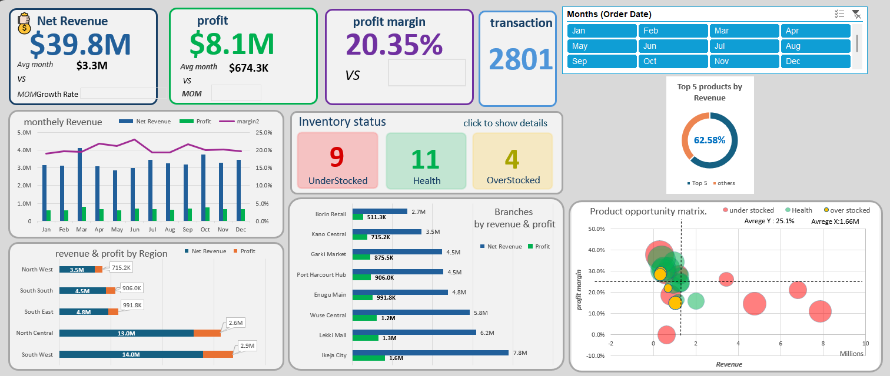
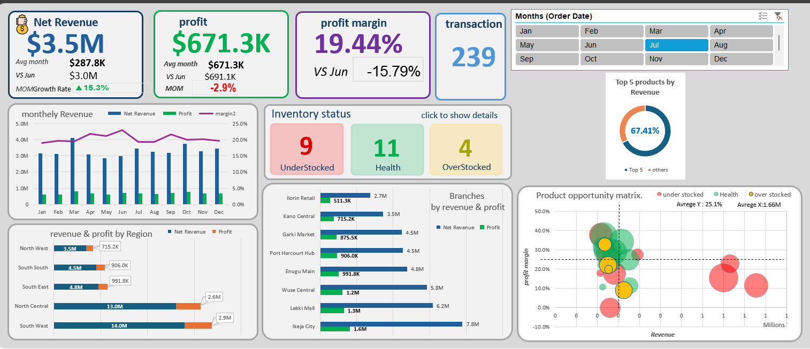

# Executive Summary: Root Cause Analysis for Retail Profit Loss

---

## 1. Problem Statement & Hypothesis Testing

The objective of this analysis is to identify the root cause behind the profitability decline for a retail company generating a **Total Net Profit of $8.09M** from a **Total Net Revenue of $39.8M** across **2,801 sales transactions**, distributed over 8 branches and 24 product SKUs.

---

## 2. Key Analytical Findings

### Discount Impact Axis:
 Direct losses resulting from aggressive discounting totaled $63,805 , accounting for 77.2%  of all loss-making transactions.
 Statistical analysis confirmed that the direct financial impact of discount-related losses is negligible, representing only **0.8%** of the company's Total Net Profit ($8.09M).
 A moderate negative correlation (**-0.55**) between discount rates and profit margins indicates that discounting is not causing direct net profit failure, but rather driving **margin erosion** across profitable orders.

### Branch Performance Axis:
 Data revealed uniform operational efficiency across all 8 branches, with an average Profit Margin of **20.35%** (tightly bound between 18.9% and 20.97%).
 This rules out branch-level operational inefficiencies or inflated fixed costs. Profit variations across locations are driven strictly by **regional sales volume**.

### Revenue Concentration & Inventory Mismanagement Axis:
 Applying Doughnut Chart highlighted critical revenue concentration: the **top 5 SKUs generate 62.58%** of total net revenue.
 The Product Opportunity Matrix confirmed that all top 5 revenue-driving SKUs (generating between $3.5M and $7.8M each) suffer from a severe **Understocked status**.

---

## 3. Executive Verdict & Root Cause

The structural root cause behind the company's profit loss is **not** aggressive discounting or branch-level operational failure. It stems directly from **supply chain inefficiencies and inventory mismanagement**—specifically, the failure to maintain adequate stock levels for core revenue-generating SKUs (representing 62.58% of total sales). This operational bottleneck creates substantial **opportunity costs** through lost sales.

---

## 4. Recommendations

### Implement Reorder Point (ROP) Systems:** Establish automated Reorder Points and Safety Stock thresholds for the top 5 revenue-generating SKUs to eliminate stockouts.
### Discount Rationalization:** Restrict discounting on high-demand, core items to protect gross profit margins from erosion.
### Overstocked SKU Liquidation:** Reprice or liquidate the 4 overstocked, low-margin SKUs to recover tied-up capital and minimize holding costs.

## 🛠️ Tools & Technologies Used
* **Data Processing:** Microsoft Excel (Power Query, Calculated Fields)
* **Data Modeling:** Pivot Tables & Advanced Formulas (`CORREL`, `AVERAGEIFS` ,`VLOOKUP` , `XLOOKUP` )
* **Data Visualization:** Excel Dashboards, Scatter Bubble Plots, Doughnut Charts
* **Methodology:** Diagnostic Analytics, MECE Framework, Root Cause Analysis (RCA)
* 
## 🖥️ Overview Dashboard

### 📅 Monthly Performance Sample

